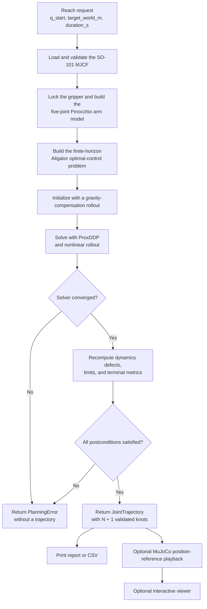

# so101-trajectory-planning

A C++23 experiment that uses Aligator ProxDDP and Pinocchio to generate a finite-duration SO-101 joint trajectory to a target `gripperframe` position. Optional playback tracks the resulting position references in MuJoCo.

## Requirements

- [Pixi](https://pixi.sh/) 0.80 or newer
- an internet connection for the first environment and robot-model download
- OpenGL and a graphical display only for the interactive viewer

`pixi.lock` pins the complete Apple Silicon environment, including Aligator 0.19.0, Pinocchio 4.0.0, MuJoCo 3.7.0, GLFW 3.4, CMake, Ninja, and the C++ compiler. CMake downloads only the SO-101 runtime model files and verifies them against hashes from an exact MuJoCo Menagerie revision.

## Build and test

```sh
pixi run build
pixi run test
```

CMake writes the compilation database to `build/pixi/compile_commands.json`; `.clangd` already points there.

## Generate a reach trajectory

Run the canonical reachable example:

```sh
pixi run reach-demo
```

Or provide a world-frame target in metres:

```sh
pixi run ./build/pixi/so101_reach \
  --target 0.31741606 -0.09770090 0.26459835 \
  --duration 2.0 \
  --q-start 0 0 0 0 0 0.25 \
  --csv
```

A successful plan contains 101 position-and-velocity knots for the default two-second horizon and reports its terminal position error, terminal frame speed, joint-limit violation, and computation time.

The planner fails closed for invalid inputs, model mismatches, solver failure, or violated postconditions. It does not silently return an invalid last iterate.

## Planning workflow and optimization problem



Aligator optimizes the five arm joints; the gripper remains fixed at its requested initial position. At knot $k$, the state and control are

$$
x_k = \begin{bmatrix}q_k \\ v_k\end{bmatrix},
\qquad u_k = \tau_k,
$$

where $q_k, v_k, \tau_k \in \mathbb{R}^5$. Joint acceleration $a(x_k, \tau_k)$ is computed by the same Pinocchio forward dynamics used by the semi-implicit Euler integrator. For $N$ stages, the solver minimizes

$$
\begin{aligned}
\min_{x_{0:N},\,\tau_{0:N-1}}\quad
&\sum_{k=0}^{N-1}
\left(
\lVert a(x_k,\tau_k)\rVert_{hI}^{2}
+ \lVert \tau_k\rVert_{10^{-3}hI}^{2}
\right) \\
&+ \lVert v_N\rVert_{10^3 I}^{2}
+ \lVert p_{ee}(q_N)-p_{target}\rVert_{10^5 I}^{2}
+ \lVert V_{ee}(x_N)\rVert_{10^3 I}^{2},
\end{aligned}
$$

subject to

$$
\begin{aligned}
x_0 &= [q_{start}, 0], \\
x_{k+1} &= F_h(x_k, \tau_k), \\
q_{min} \le q_k &\le q_{max} && k=0,\ldots,N-1, \\
\lvert v_k \rvert &\le 4\ \mathrm{rad/s} && k=0,\ldots,N-1, \\
\lvert \tau_k \rvert &\le 2.94\ \mathrm{N\,m} && k=0,\ldots,N-1.
\end{aligned}
$$

Here, $F_h$ is the semi-implicit Euler discretization, $h = \text{duration}/N$, and $N$ is chosen near the nominal 20 ms timestep, with a hard limit of 1000 stages. The terminal terms drive the `gripperframe` position to the target while reducing terminal joint and frame velocity. Acceleration regularization discourages the optimizer from waiting and performing nearly all motion at the end of the horizon.

Solver convergence alone is insufficient. Before returning a trajectory, the planner independently checks every knot, including the terminal state, and requires finite states and controls, final position error at most 5 mm, final frame speed at most 0.02 m/s, joint/velocity/effort violations at most $10^{-6}$, and maximum dynamics defect at most $10^{-5}$. The formulation is defined in [`aligator_reach_planner.cpp`](src/core/aligator_reach_planner.cpp); the complete behavioral contract is in [specification 001](specs/001-aligator-reach-trajectory.md).

## MuJoCo playback

Open the viewer and watch the canonical trajectory in real time:

```sh
pixi run playback-demo
```

For a custom target, add `--visual` to the reach command. The flag implies `--playback`:

```sh
pixi run ./build/pixi/so101_reach \
  --target 0.31741606 -0.09770090 0.26459835 \
  --duration 2.0 \
  --q-start 0 0 0 0 0 0.25 \
  --visual
```

The viewer plays at real-time simulation speed, pauses on the final pose, and restarts the trajectory when `R` or `Backspace` is pressed. Use `pixi run playback-headless` when no graphical display is available.

Playback linearly resamples the planned joint positions at MuJoCo's timestep and reports Cartesian terminal tracking error and maximum joint tracking error. It sends position references to all six MuJoCo position actuators; Aligator's internal optimized torques are not exposed or executed. This is simulator position control, not evidence of hardware readiness.

## Simulator

```sh
pixi run sim
pixi run headless
```

Viewer controls:

- left mouse: rotate the camera
- right mouse: pan the camera
- middle mouse or scroll: zoom
- `Space`: pause/resume
- `R` or `Backspace`: reset
- `Esc`: quit

To use a local copy of the pinned robot model, configure CMake explicitly:

```sh
pixi run cmake -S . -B build/pixi -G Ninja \
  -DCMAKE_BUILD_TYPE=Release \
  -DCMAKE_PREFIX_PATH="$CONDA_PREFIX" \
  -DAMP_SO101_MODEL_DIR=/path/to/mujoco_menagerie/robotstudio_so101
```

## Scope and architecture

`AligatorReachPlanner` accepts a start joint configuration, a world-frame position target, and a duration. It returns a project-owned `JointTrajectory`; Aligator and Pinocchio types remain private to the planner implementation. `TrajectoryPlayer` separately consumes the trajectory, so simulation does not depend on the planner.

The current optimizer uses five arm joints and locks the gripper at its initial position. It enforces experimental velocity limits, the model's 2.94 Nm actuator evidence, and model joint limits. Collision avoidance, orientation targets, automatic duration optimization, online replanning, and hardware execution are not implemented.

The full contract, acceptance thresholds, and class diagram are in [specification 001](specs/001-aligator-reach-trajectory.md).

The SO-101 model is sourced from [MuJoCo Menagerie](https://github.com/google-deepmind/mujoco_menagerie/tree/main/robotstudio_so101) and is licensed under Apache-2.0. Its license is downloaded alongside the model assets.
