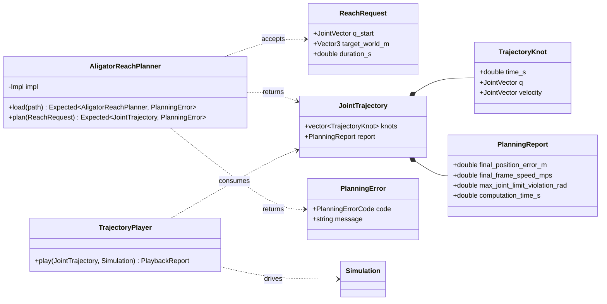

# SO-101 end-effector reach trajectory with Aligator

Status: Proposed  
Target library: Aligator 0.19.0 from conda-forge  
Robot: fixed-base SO-101  
Primary implementation language: C++23  
Dependency manager: Pixi

## Summary

Given a valid initial SO-101 joint configuration and a target Cartesian position, compute a finite-duration joint trajectory that moves the `gripperframe` to the target. `AligatorReachPlanner` uses Aligator for constrained trajectory optimization with a Pinocchio model loaded from the same pinned MJCF model as the MuJoCo simulator.

This increment evaluates whether Aligator can generate a valid SO-101 reaching trajectory. It does not implement a general motion-planning system, collision avoidance, or a production controller.

## Motivation

The repository currently provides deterministic MuJoCo model loading, stepping, actuator-control access, reset behavior, headless execution, and visualization. It deliberately does not yet contain a motion planner or controller.

Aligator is a trajectory-optimization library rather than a geometric path planner. The useful result of this experiment is therefore a time-parameterized sequence of robot states and controls, not only a curve followed by the end-effector.

## Terminology

- **Configuration** `q`: the six SO-101 joint positions in MuJoCo joint order.
- **Arm configuration** `q_arm`: the five arm joint positions, excluding the gripper joint.
- **State** `x = (q_arm, v_arm)`: arm configuration and joint velocity.
- **Control** `u = tau`: commanded arm joint torque inside the Aligator formulation; it is not part of the common planner interface.
- **End-effector**: the MJCF site named `gripperframe`.
- **Planned trajectory**: the time-parameterized joint states returned by the planner and validated against its postconditions.
- **Playback**: using the planned joint positions as references for MuJoCo's position actuators.

## Goals

1. Load a Pinocchio model from the pinned SO-101 MJCF used by MuJoCo.
2. Verify that Pinocchio and MuJoCo agree on the robot's joint mapping and end-effector placement.
3. Given `q_start`, a world-frame target position, and a duration, solve a reaching problem with Aligator.
4. Return a validated trajectory and diagnostics through a small project-owned interface.
5. Exercise the planner in a deterministic headless integration test.
6. Allow optional visualization of the planned motion in MuJoCo without presenting playback as execution of Aligator's optimized torques.
7. Keep Aligator types outside the interface seen by callers and playback.

## Non-goals

The first increment does not include:

- an end-effector orientation target;
- collision or self-collision avoidance;
- geometric obstacle planning;
- automatic trajectory-duration optimization;
- online replanning or model-predictive control;
- Cartesian-start input without an accompanying joint configuration;
- gripper opening or closing during the reach;
- execution on physical hardware;
- proof of simulator-to-hardware fidelity;
- proof that MuJoCo can track Aligator's optimized torque controls.

These capabilities require separate evidence and must not be inferred from a successful reach experiment.

## User-visible behavior

### Input

A planning request contains:

- `q_start`: six finite joint positions in canonical MuJoCo joint order;
- `target_world_m`: a finite three-dimensional target in metres, expressed in the MuJoCo/Pinocchio world frame;
- `duration_s`: a finite, strictly positive trajectory duration.

The start Cartesian position is computed from `q_start`. A Cartesian position alone is not accepted as the start because inverse kinematics can yield multiple configurations for the same point.

The initial gripper joint position is preserved for every returned knot.

### Output

A successful result contains:

- exactly `N + 1` state knots;
- a strictly increasing timestamp, six joint positions, and six joint velocities for every knot;
- a report containing final position error, final frame speed, maximum joint-limit violation, and computation time.

The exposed gripper velocity is zero because the gripper is locked during planning.

### Failure behavior

The planner returns an error and no trajectory when:

- a request contains non-finite values;
- `duration_s` is not positive;
- `q_start` violates a joint limit;
- the model does not have the expected joint mapping;
- the exact `gripperframe` cannot be constructed;
- Aligator cannot produce a valid plan;
- the returned data contain non-finite values;
- any acceptance postcondition is violated.

The implementation must not silently clamp the input, substitute another end-effector frame, discard constraint violations, or return the solver's last iterate as a successful trajectory.

## Robot-model contract

### Canonical joint order

The project-owned trajectory uses this order:

1. `shoulder_pan`
2. `shoulder_lift`
3. `elbow_flex`
4. `wrist_flex`
5. `wrist_roll`
6. `gripper`

The planner optimizes the first five joints and locks `gripper` at its initial value.

### End-effector frame

The end-effector is the `gripperframe` MJCF site, including its local translation and rotation relative to the `gripper` body. If Pinocchio's MJCF parser does not expose this site as a frame, the loader must explicitly add a fixed Pinocchio frame using the transform declared for `gripperframe` in the pinned MJCF.

The loader must not fall back to the origin of the `gripper` body because that would change the endpoint being planned.

### MuJoCo/Pinocchio parity gate

Before the planner is considered usable, an integration test must verify:

- the same six joint names and ordering;
- equivalent lower and upper joint-position limits;
- the same fixed-base convention;
- `gripperframe` world translations differing by at most `1e-6 m` at `q_start` and at one non-zero reference configuration.

Failure of any parity check blocks trajectory optimization.

## Optimal-control formulation

### State and control

- State: `x = [q_arm, v_arm]`.
- Control: `u = tau_arm`.
- Initial state: `x0 = [q_start_arm, 0]`.
- Dynamics: Aligator `MultibodyFreeFwdDynamics` with identity actuation for the reduced five-joint Pinocchio model.
- Discretization: semi-implicit Euler.
- Initial horizon: `duration_s = 2.0 s`, `dt = 0.02 s`, and `N = 100`.
- Resource bound: reject durations requiring more than 1000 integration intervals rather than allocating an unbounded problem.
- Solver: `SolverProxDDP` with nonlinear rollout.
- Initial guess: a rollout from repeated gravity-compensation torques at the initial configuration.

The horizon and solver settings are versioned implementation configuration. They are not exposed as unrestricted solver knobs through the planner interface.

### Running objective

Each running stage penalizes:

- joint acceleration computed by the same Pinocchio forward dynamics used by the integrator;
- joint torque.

The acceleration term distributes motion across the fixed horizon without prescribing an intermediate Cartesian path. The small torque term discourages unnecessarily large actuator effort. Both stage costs are scaled consistently with `dt`.

Torque variation may be added later only if the first validated trajectory is insufficiently smooth. It is not part of the initial formulation.

### Terminal objective

The terminal stage penalizes:

- `FrameTranslationResidual` from `gripperframe` to `target_world_m`, with a high weight;
- `FrameVelocityResidual` from `gripperframe` to zero, with a high weight;
- arm joint velocity relative to zero, with a high weight.

The final Cartesian tolerance is a validated postcondition. A large terminal cost alone does not establish success.

### Constraints

At every applicable knot, enforce:

- arm joint-position limits from the canonical model;
- conservative experimental arm joint-velocity limits;
- actuator effort limits supported by the model evidence.

Velocity limits must be stored as project configuration and labelled experimental until an authoritative SO-101 hardware specification is recorded. They must not be described as certified hardware limits.

## Module design

The planner is a deep module: callers load `AligatorReachPlanner`, provide a reach request, and receive either a validated trajectory or a structured error. Model construction, costs, constraints, solver settings, initialization, and Aligator-specific validation stay inside its implementation.

There is deliberately no strategy interface or factory while Aligator is the only planner. A second planner should first demonstrate a real substitution need before introducing a seam.

The reusable result type is named `JointTrajectory`, not `ReachTrajectory`. Reaching is how the trajectory is requested; playback and future controllers only need the resulting time-indexed joint motion.

```cpp
namespace so101_traj_planner {

using JointVector = std::array<double, 6>;

struct ReachRequest {
  JointVector q_start;
  Eigen::Vector3d target_world_m;
  double duration_s;
};

struct TrajectoryKnot {
  double time_s;
  JointVector q;
  JointVector velocity;
};

struct PlanningReport {
  double final_position_error_m;
  double final_frame_speed_mps;
  double max_joint_limit_violation_rad;
  double computation_time_s;
};

struct JointTrajectory {
  std::vector<TrajectoryKnot> knots;
  PlanningReport report;
};

enum class PlanningErrorCode {
  invalid_request,
  model_mismatch,
  frame_missing,
  planning_failed,
  validation_failed,
};

struct PlanningError {
  PlanningErrorCode code;
  std::string message;
};

class AligatorReachPlanner {
 public:
  [[nodiscard]] static std::expected<AligatorReachPlanner, PlanningError> load(
      const std::filesystem::path& robot_mjcf);

  ~AligatorReachPlanner();
  AligatorReachPlanner(AligatorReachPlanner&&) noexcept;
  AligatorReachPlanner& operator=(AligatorReachPlanner&&) noexcept;

  [[nodiscard]] std::expected<JointTrajectory, PlanningError> plan(
      const ReachRequest& request) const;

 private:
  class Impl;
  explicit AligatorReachPlanner(std::unique_ptr<Impl> impl);
  std::unique_ptr<Impl> impl_;
};

}  // namespace so101_traj_planner
```

The public interface must not expose Aligator solver objects, Aligator residuals, Pinocchio models, optimized torques, dynamics defects, or numerical cost weights. The planner validates its torque and dynamics results internally before constructing a successful result.

`so101_traj_planner::Simulation` remains independent of Aligator. Playback consumes `JointTrajectory` through a separate project-owned module rather than adding planner responsibilities to the simulation module.

### Class diagram



## Validation and acceptance criteria

A result is successful only when all of the following hold:

| Property | Required value |
| --- | ---: |
| Planner outcome | successful |
| Returned values | all finite |
| State knots | `N + 1` |
| Timestamps | start at zero, strictly increase, and end at `duration_s` |
| Initial configuration error | `<= 1e-9 rad` |
| Final Cartesian position error | `<= 0.005 m` |
| Final Cartesian frame speed | `<= 0.02 m/s` |
| Joint-position limit violation | `<= 1e-6 rad` |
| Gripper position deviation | `<= 1e-12 rad` |

Computation time is recorded but does not initially determine pass or failure. A performance threshold may be introduced after a reproducible baseline exists.

### Aligator-specific acceptance

Before returning a common successful trajectory, `AligatorReachPlanner` additionally requires:

| Property | Required value |
| --- | ---: |
| Aligator solver status | converged |
| Internal state knots | `N + 1` |
| Internal control knots | `N` |
| Effort-limit violation | `<= 1e-6 Nm` |
| Maximum dynamics defect | `<= 1e-5` |

These conditions are stronger evidence provided by the Aligator implementation. They do not become requirements for a future planner that uses a different model, but that planner must document and enforce its own additional validity conditions.

## Test scenarios

### Model parity

Load the same pinned MJCF into MuJoCo and Pinocchio. Compare joint metadata and the `gripperframe` transform at zero and non-zero configurations.

### Reachable target

Choose an in-limit `q_reference` that is not the initial configuration. Compute `target_world_m` from its Pinocchio forward kinematics, then plan from `q_start` to that position.

The test checks the target position, not equality with `q_reference`, because a position-only reach can have multiple valid joint solutions.

For this canonical non-zero reach, the arm-joint displacement norm at the midpoint must be at least 10% of its terminal displacement norm. This regression check rejects solutions that postpone nearly all motion until the end of the horizon; it is not a general smoothness metric.

### No-op target

Set the target to the end-effector position at `q_start`. The planner must succeed and the maximum joint displacement must remain below a small documented tolerance.

The Aligator planner uses `1e-3 rad` as that no-op displacement tolerance.

### Invalid requests

Reject at least:

- a NaN target coordinate;
- a zero or negative duration;
- a start configuration outside a joint limit.

### Unreachable target

Use a point clearly outside the SO-101 workspace. The call must return `planning_failed` or `validation_failed`; it must not return a successful trajectory with a large terminal error.

### Constraint regression

For the canonical reachable trajectory, independently recompute joint-limit violations from every returned knot. The Aligator planner test additionally checks its internal effort and dynamics constraints.

### Strategy contract

Run the reachable, no-op, invalid, and unreachable request suite against `AligatorReachPlanner`.

## MuJoCo playback

Playback linearly interpolates the planned joint positions from the planning timestep to MuJoCo's simulation timestep and sends those positions to the six position actuators. The gripper reference remains fixed.

Playback reports, separately:

- the planned terminal error computed with Pinocchio;
- the simulated terminal tracking error computed with MuJoCo;
- maximum joint tracking error over the playback.

The optimized torque controls are not sent to the current MuJoCo position actuators. Consequently, successful playback is evidence of position-reference tracking in this simulator, not execution of the optimized torque trajectory.

Interactive playback is selected with `--visual` (which implies `--playback`). The GLFW viewer advances at real-time simulation speed, pauses on the final pose, and restarts the same trajectory when the user presses `R` or `Backspace`. Headless playback remains available for automated verification.

The first increment requires playback to run without non-finite state or simulator failure. It does not set a tracking-error acceptance threshold until a baseline has been measured.

## Dependency-management decision

Pixi becomes the project's sole declared native dependency environment. It is better suited to this experiment because Aligator and its Pinocchio integration are distributed through conda-forge, Aligator itself uses Pixi for development, and compatible Apple Silicon packages exist for Aligator, MuJoCo, and GLFW.

The initial manifest targets `osx-arm64` and constrains at least:

| Package | Constraint | Reason |
| --- | --- | --- |
| `aligator` | `==0.19.0` | Packaged for `osx-arm64`; exact build recorded by `pixi.lock` |
| `pinocchio` | `==4.0.0` | Required by the packaged Aligator 0.19.0 `osx-arm64` build; the exact build is recorded by `pixi.lock` |
| `libmujoco` | `==3.7.0` | Preserves the simulator version used by the previous Conan environment |
| `glfw` | `==3.4` | Preserves the viewer version used by the previous Conan environment |
| `cmake` | `>=3.24` | Preserves the repository's minimum build requirement |
| `ninja` | compatible locked version | Provides a reproducible CMake build backend |
| `cxx-compiler` | compatible locked version | Provides the compiler environment expected by conda-forge libraries |

Python may be pinned if required to select an Aligator package variant, but Python is not part of the planner's runtime interface.

The experiment uses packaged Aligator `0.19.0` instead of adding a second source-build path. Its conda-forge `osx-arm64` build depends on Pinocchio 4.0.0, so the locked package graph takes precedence over the earlier Pinocchio 3.x assumption. Upgrading is a separate, tested dependency change.

`pixi.toml` declares the environment and named tasks. `pixi.lock` is committed and is the reproducibility source of truth for exact package builds. Normal build and test instructions use `pixi run`; they must not depend on an activated global Conda environment.

### Migration gates

The Conan-to-Pixi migration proceeds in this order:

1. Add `pixi.toml`, resolve `pixi.lock`, and verify that the environment contains only native `osx-arm64` packages.
2. Compile a minimal C++ executable and link the installed `aligator::aligator` target.
3. Configure and build the existing `so101_sim` executable entirely inside Pixi using `libmujoco 3.7.0` and `glfw 3.4`.
4. Run the existing headless simulation test without changing its behavioral assertions.
5. Load the pinned SO-101 MJCF with Pinocchio and pass the MuJoCo/Pinocchio parity gate.
6. Solve and validate the canonical reachable target headlessly.
7. Remove `conanfile.txt`, `conan.lock`, and Conan-specific presets or documentation only after gates 1 through 6 pass.

At no point may one executable link a mixture of Pixi/conda-forge and Conan variants of the same native libraries. If the existing simulator cannot be reproduced under Pixi, the migration stops and the failure is documented before another dependency arrangement is chosen.

The implementation passed gates 1 through 6, after which the Conan manifest and lock were removed. Pixi is now the only supported dependency workflow.

## Deliverables

The completed increment contains:

- a reproducible `pixi.toml` and committed `pixi.lock` covering Aligator, Pinocchio, MuJoCo, GLFW, and the C++ build tools;
- named Pixi tasks for configure, build, headless tests, and the reach demonstration;
- the `AligatorReachPlanner` interface and implementation;
- model-parity validation;
- headless tests for the scenarios above;
- a command-line reach example with an explicit target;
- optional MuJoCo playback;
- README instructions that distinguish planning, simulation tracking, and hardware claims.

## Open decisions

The following decisions are intentionally deferred until the dependency and model-parity spike provides evidence:

1. The exact conservative experimental velocity limits.
2. Numerical cost weights and solver regularization values needed to satisfy the fixed acceptance criteria.
3. Whether MuJoCo playback belongs in the existing executable or a separate demonstration executable.
4. Whether a future second planner provides enough value to justify introducing a strategy seam.

## References

- [Aligator repository and installation documentation](https://github.com/Simple-Robotics/aligator)
- [Aligator 0.19.0 conda-forge package](https://anaconda.org/conda-forge/aligator)
- [Aligator UR5 reaching example](https://github.com/Simple-Robotics/aligator/blob/v0.19.0/examples/ur5_reach.py)
- [Aligator CMake example project](https://github.com/Simple-Robotics/aligator-cmake-example-project)
- [Pinocchio repository and MJCF support](https://github.com/stack-of-tasks/pinocchio)
- [Pixi environment and lock-file behavior](https://pixi.sh/latest/workspace/environment/)
